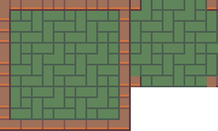
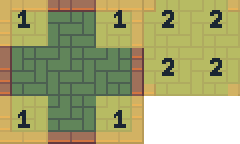
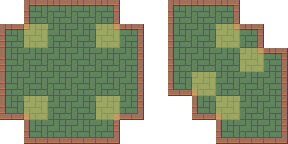
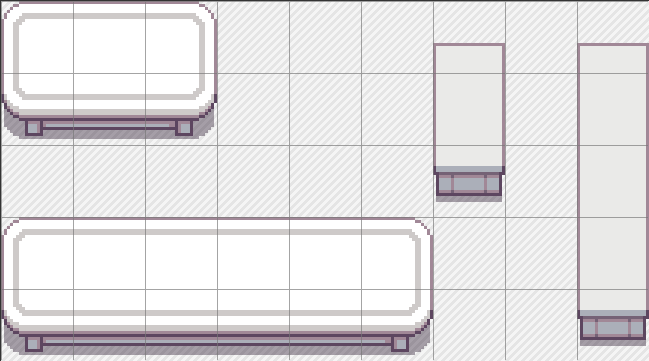
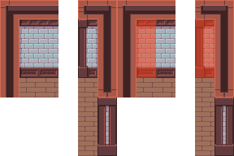

# Using TwilioQuest Tilesets: Style Guide

The `twilioquest-base` extension provides a large variety of tileable art assets that can be used to build new maps within TwilioQuest. The majority of 
these art assets are mapped to a grid-based layout in `TwilioQuestTileset.png`. 

If this is your first time encountering TwilioQuest tilesets, the number of assets you can use can be a little overwhelming! This guide will help you not 
only identify important tiles, but also how to use them to match the quality of level design found in TwilioQuest.

---

## Repeatable tiles

Some tiles in `TwilioQuestTileset.png` can be placed next to themselves to create a pattern. These repeatable patterns assist in breaking up the grid-like 
appearance of the tiles. Below is a common layout example of ground tiles in the tileset that can repeat. This layout is made up of 4 different types of 
tiles.

First, you have the **outer corner tiles (1) and inner corner tiles (2)**. These tiles are not repeatable, but act as crucial “end-points” to tiles in 
the layout that are. The inner corner tiles are also easily missed or forgotten about when building maps, so please take care to look over your map and
make sure there are no missing spots where inner corners are needed.

Second, are the **middle edge tiles**, which are only repeatable on a horizontal or vertical plane. The left and right edge tiles can repeat when placed
vertically to itself, while the top and bottom edge tiles can only be repeated horizontally. 

Lastly, you have the **center tile**. This tile will have a continuous, repeatable pattern when placed on any tile above, below, or beside itself.

When used together, these tiles can create a variety of shapes that suit your needs. The inner corners have been highlighted in the example below to show
where you would typically use them.

You will also find that many (but not all) decorative tiles that are 3 tiles wide or 3 tiles tall will be extendable via the middle tile(s). Feel free to experiment with different lengths of these tiles as needed for your map. 

### Trees

Trees that are bunched in groups of seven like below are also repeatable with a few steps:

1. Start by taking a section of the middle like this 2x4 area, so that it repeats cleanly if placed above, below, or beside itself. 
2. Then, tile the section as much as you need, without overlapping.
3. Once the section is your desired size, then fill in the edges utilizing the outer tiles of the bunched trees.

---

## Wall Tiles

Wall tiles in TwilioQuest require following a few guidelines to maintain a consistent look. First, it’s important to get acquainted with the different 
wall tile types in order to use them appropriately. A typical set of wall tiles in the tileset will have this layout:

These tiles have been broken down into 5 different uses, sorted by colour.

**Green (1)**: These tiles are the **main wall tiles** you will be using to create your rooms. Like the ground tiles shown in the previous section titled “Repeating Tiles”, these walls are made into a 3x3 layout with a mix of corner, middle edge, and center tiles.

**Red (2)**: These tiles are similar to the green tiles, however they have one key difference: they have **shadows along the sides to be placed as inner corner walls**. Here are two examples of where they would be used:

**Yellow (3)**: These are the “**top wall**” tiles. These tiles are to be placed above any of the green, red, blue or purple tiles. Some variations of these tiles are helpful for indicating where multiple walls may intersect. 

**Blue (4)**: The **single-column blue tile is used wherever a vertical wall ends**. If you are creating a gap in the vertical wall for the player to pass through, it is important to remember to leave enough room to place these blue column tiles. Here is an example below of correct usage:

**Purple (5)**: The purple tiles are to indicate any extra tiles you might find placed with the wall tiles. Some wall tiles, like in this grouping, have columns to help add some additional detailing to the walls. Other common wall tiles you might find are cracked bricks, windows, etc.

### Common Guidelines to Follow

- In TwilioQuest, **we maintain a consistent wall height of 3 tiles and 1 top wall, which equals 4 tiles overall**. There may be some exceptions to this rule of height, but in most cases having 3 vertical tiles and 1 top wall will help maintain the look of TwilioQuest, and will be the best height to work alongside other tiles. 
- Remember to **always place and leave room for the 3 tile-high walls below the top wall tiles**. This includes any nooks and crannies in the layout, and the outer exterior of the room as well. Please refer to the example below:

